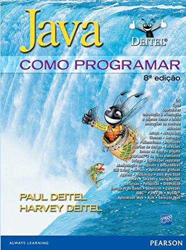

- [Curso Maratona Java DevDojo](https://www.youtube.com/watch?v=VKjFuX91G5Q&list=PL62G310vn6nFIsOCC0H-C2infYgwm8SWW&index=1&ab_channel=DevDojo)
- [Apostila Java Web Caelum](https://www.caelum.com.br/apostila/apostila-java-web.pdf)
- Java como Programar  8° Edicao [Paul Deitel. Harvey Deitel.]  

